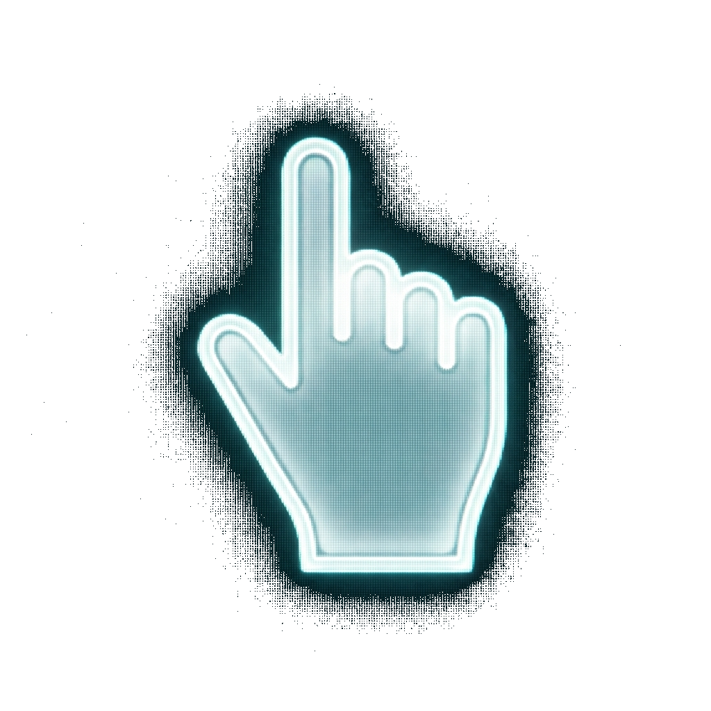

# GhostHand 👻✋

  

**GhostHand** is a lightweight, AI-powered tool that transforms your webcam into a precise touchless mouse controller. Navigate your computer, browse the web, and control media without touching your mouse or trackpad.

Designed for accessibility, hygiene, and futuristic control, GhostHand uses **Google MediaPipe** for robust hand tracking and the **1€ Filter** for jitter-free, smooth cursor movement.



## ✨ Key Features

*   **👆 Precision Tracking**: Control the cursor by pointing with your index finger.
*   **🖱️ Touchless Clicking**: Simply **flick your thumb** open to Left Click. No hovering or dwelling required.
*   **📜 Natural Scrolling**: Raise two fingers (Peace Sign) and move your hand up/down to scroll content physically.
*   **💤 Smart Wake/Sleep**: Shake your open palm to wake the system or put it to sleep to prevent accidental inputs.
*   **🔒 Single Instance Lock**: Prevents multiple copies from running and conflicting for camera access.
*   **⚙️ Profiles**: Save and switch between unlimited sensitivity profiles (e.g., "Precision", "Relaxed", "3 Monitor Setup").

## 🚀 Installation & Setup

### Pre-built Executable (Windows)
1.  Download the latest `GhostHand.exe` from the [Releases Page](#).
2.  Place it in a folder of your choice (e.g., `Documents/GhostHand`).
3.  Run `GhostHand.exe`. The application will minimize to the **System Tray**.

### Running from Source
If you are a developer, you can run GhostHand directly from Python.

```bash
# 1. Clone the repository
git clone https://github.com/yourusername/GhostHand.git
cd GhostHand

# 2. Create a virtual environment
python -m venv venv
.\venv\Scripts\activate

# 3. Install dependencies
pip install -r requirements.txt

# 4. Run the application
python main.py
```

## 🎮 How to Use

| Action | Gesture | Description |
| :--- | :--- | :--- |
| **Move Cursor** | **Index Finger UP** | Keep other fingers relaxed/closed. Move your hand to move the mouse. |
| **Left Click** | **Thumb Flick** | Start with your thumb pinching your index finger, then quickly **flick it open** sideways. |
| **Scroll** | **Two Fingers UP** | Raise Index + Middle fingers (✌️). Move your hand **Up/Down** to drag the page. |
| **Wake / Sleep** | **Wave / Hold** | Hold your **Open Palm** steady for 1s, or give a quick "Wave" to toggle active mode. |

> **Tip:** You can toggle the camera view ("Silhouette Mode") from the System Tray right-click menu to see what the AI sees.

## ⚙️ Configuration

Right-click the System Tray icon and select **Settings** to configure:

*   **Sensitivity (X/Y)**: Adjust how fast the cursor moves relative to your hand. Higher = Faster.
*   **Click Threshold**: Adjust how far the thumb must move to register a click.
*   **Keep Awake**: Check this to disable the "Sleep" gesture (useful for presentations).
*   **High Performance**: Enables Higher Definition tracking (uses more CPU).
*   **Invert Scroll**: Reverses the scroll direction creates a "Natural Scrolling" feel (Hand Down = Content Up).

## 🔧 Troubleshooting

*   **"Camera not found"**: Ensure no other app (Zoom, Teams) is using the webcam.
*   **Cursor is shaky**: Improve lighting in your room. Avoid strong backlighting behind you.
*   **Gestures not registering**: Open the **Debug View** (Tray context menu) to ensure the skeleton is tracking your fingers correctly.

## 📦 Building

To create your own standalone executable:

1.  Ensure you have development dependencies installed (`pip install pyinstaller`).
2.  Run the build script:
    ```cmd
    build_exe.bat
    ```
3.  The output file will be in the `dist/` folder.

## 📄 License

This project is licensed under the **MIT License**. See the [LICENSE](LICENSE) file for details.
